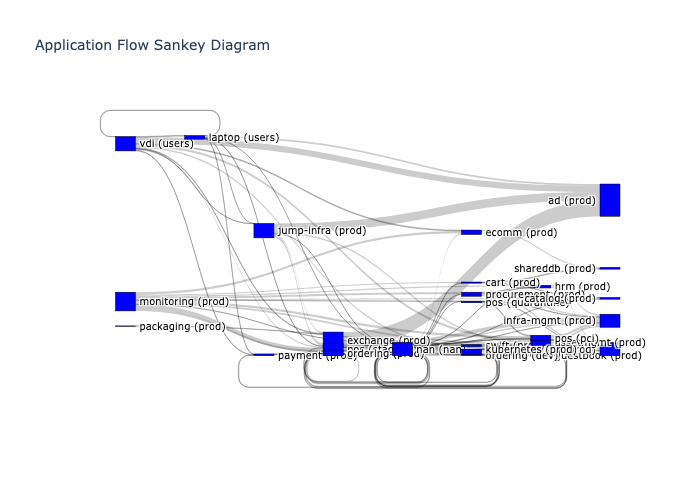

# Illumio App Dpndr

## Overview
This project provides a solution for visualizing network dependencies and traffic flows using AWS services. It generates a Sankey diagram based on traffic data from the Illumio PCE (Policy Compute Engine).

The cli version has extended capabilities for generating graphviz, sankey and sunburst diagrams.

## Examples

### Sankey Diagram


## Features
- Fetches traffic data from Illumio PCE
- Generates a Sankey diagram to visualize network dependencies
- Hosted on AWS using Lambda, API Gateway, and S3

## Architecture

- Frontend: HTML/JavaScript, hosted on S3
- Backend: AWS Lambda, API Gateway
- Data Processing: Python with Illumio SDK, Plotly for visualization

## Prerequisites

- AWS Account with appropriate permissions
- Python 3.8+
- AWS CLI configured
- Illumio PCE access (host, API key, and secret)

## Setup Instructions

### 1. AWS Services Configuration

#### S3 Bucket
1. Create an S3 bucket for hosting the frontend and storing generated graphs:
   ```
   aws s3 mb s3://your-bucket-name
   ```
2. Enable static website hosting for the bucket.
3. Apply the following bucket policy (replace `your-bucket-name`):
   ```json
   {
       "Version": "2012-10-17",
       "Statement": [
           {
               "Sid": "PublicReadGetObject",
               "Effect": "Allow",
               "Principal": "*",
               "Action": "s3:GetObject",
               "Resource": "arn:aws:s3:::your-bucket-name/*"
           }
       ]
   }
   ```

#### Lambda Function
1. Create a new Lambda function.
2. Use the provided Lambda function code.
3. Set up an IAM role with permissions for S3 access and CloudWatch Logs.
4. Set the `S3_BUCKET_NAME` environment variable in the Lambda configuration.

#### API Gateway
1. Create a new API in API Gateway.
2. Set up a POST method and integrate it with your Lambda function.
3. Enable CORS for your API.
4. Deploy the API and note the endpoint URL.

### 2. Frontend Setup
1. Update the `index.html` file with your API Gateway endpoint.
2. Upload the `index.html` file to your S3 bucket:
   ```
   aws s3 cp index.html s3://your-bucket-name/index.html
   ```

### 3. Backend Setup
1. Install required Python packages for local development:
   ```
   pip install -r requirements.txt
   ```
2. Package your Lambda function with these dependencies.
3. Deploy the packaged function to AWS Lambda.

## Usage
1. Navigate to the S3 website URL.
2. Fill in the form with your Illumio PCE details:
   - PCE Host
   - Port
   - Organization ID
   - API Key
   - API Secret
3. Click "Generate Graph" to create the Sankey diagram.
4. The generated graph will open in a new tab.

## Customization
- To modify the time range for data collection, adjust the `TrafficQuery` parameters in the Lambda function.
- To change the visualization type, modify the `generate_sankey_diagram` function in the Lambda code.

## Troubleshooting
- Check CloudWatch Logs for Lambda function errors.
- Ensure all IAM permissions are correctly set up.
- Verify CORS settings in API Gateway if experiencing frontend issues.

## Contributing
Contributions to this project are welcome. Please fork the repository and submit a pull request with your changes.

## License
[Specify your license here]

## Contact

alex.goller@illumio.com