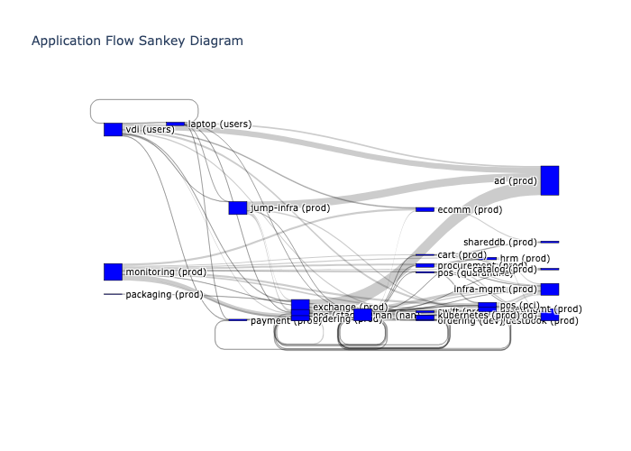
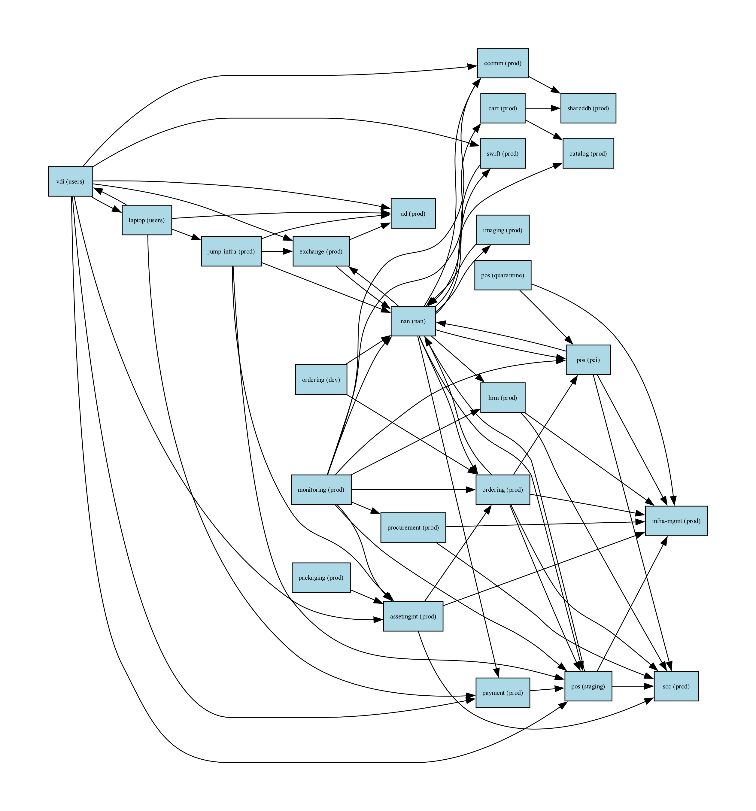
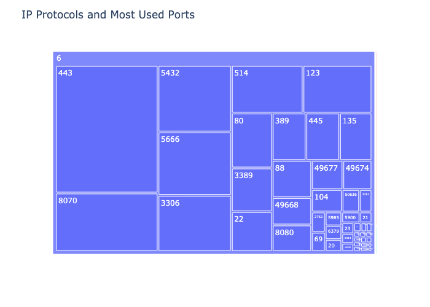
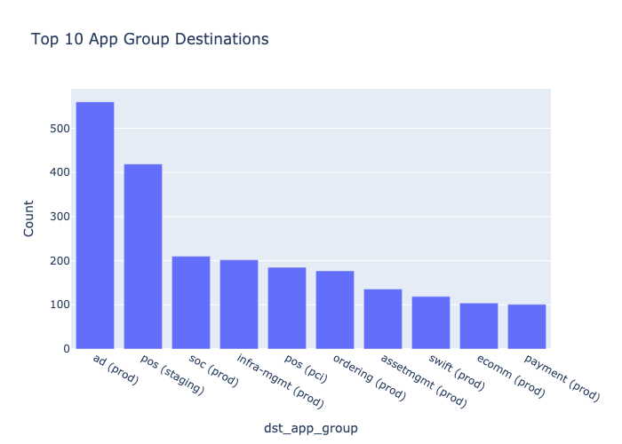
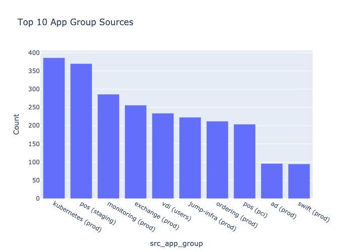
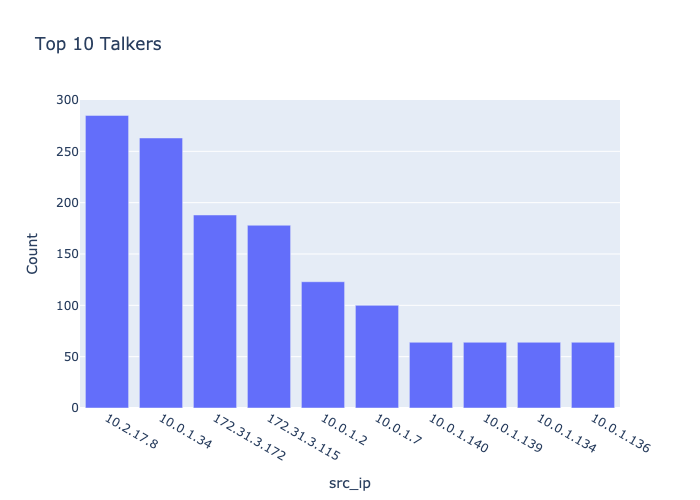
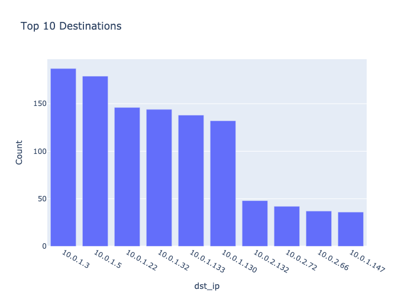
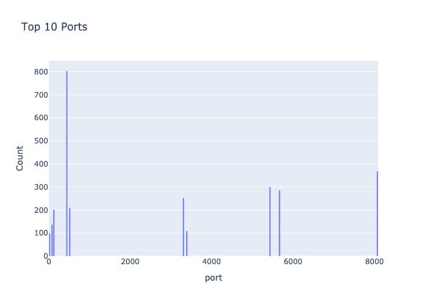

# Illumio CLI Tool

This CLI tool provides various functionalities for analyzing and visualizing traffic data from Illumio PCE (Policy Compute Engine).

## Examples

### Sankey Diagram



### Sunburst Diagram


### Graphviz Directed Graph



## Traffic analyze command












## Installation

1. Ensure you have Python 3.x installed.
2. Install the required dependencies:

```bash
pip install -r requirements.txt
```

## Configuration

You can set the following environment variables to avoid entering them as command-line arguments each time:

- `ILLUMIO_PCE_HOST`: PCE host
- `ILLUMIO_PCE_PORT`: PCE port
- `ILLUMIO_PCE_ORG_ID`: Organization ID
- `ILLUMIO_PCE_API_KEY`: API key
- `ILLUMIO_PCE_API_SECRET`: API secret

For example:

```bash
export ILLUMIO_PCE_HOST=your-pce-host.com
export ILLUMIO_PCE_PORT=8443
export ILLUMIO_PCE_ORG_ID=1
export ILLUMIO_PCE_API_KEY=your-api-key
export ILLUMIO_PCE_API_SECRET=your-api-secret
```

## Usage

The general structure of commands is:

```bash
python illumio_cli.py [COMMAND] [OPTIONS]
```

Global options (can be set via environment variables):
- `--pce-host`: PCE host
- `--port`: PCE port
- `--org-id`: Organization ID
- `--api-key`: API key
- `--api-secret`: API secret
- `--start`: Start date (default: '30 days ago')
- `--end`: End date (default: 'today')
- `--limit`: Maximum number of traffic flows to fetch (default: 2000)

### Available Commands

1. `traffic`: Generate traffic graph
2. `analyze`: Generate multiple analysis views
3. `top_talkers`: Generate a graph of top talkers
4. `top_destinations`: Generate a graph of top destinations
5. `top_ports`: Generate a graph of top ports
6. `ip_protocol_treemap`: Generate a treemap of IP protocols and ports
7. `top_app_group_sources`: Generate a graph of top app group sources
8. `top_app_group_destinations`: Generate a graph of top app group destinations
9. `top_talking_app_env_treemap`: Generate a treemap of top talking app/env tuples
10. `top_receiving_app_env_treemap`: Generate a treemap of top receiving app/env tuples

### Examples

1. Generate a traffic graph:
```bash
python illumio_cli.py traffic --output my_traffic_graph --format png --diagram-type sankey
```

2. Analyze traffic data:
```bash
python illumio_cli.py analyze --output traffic_analysis --format html --top-n 15
```

3. Generate top talkers graph:
```bash
python illumio_cli.py top_talkers --output top_talkers --format svg --top-n 20
```

4. Generate IP protocol treemap:
```bash
python illumio_cli.py ip_protocol_treemap --output protocol_treemap --format html
```

## Output Formats

Most commands support the following output formats:
- HTML (interactive)
- PNG
- JPG
- SVG

Note: The `graphviz` diagram type in the `traffic` command does not support HTML output.

## Additional Notes

- The `start` and `end` options accept dates in the format 'YYYY-MM-DD' or relative dates like '30 days ago'.
- The `traffic` command supports different diagram types: sankey, sunburst, and graphviz.
- The graphviz diagram can be oriented left-to-right (LR) or top-to-bottom (TB) using the `--direction` option.

For more detailed information on each command and its options, use the `--help` flag:

```bash
python illumio_cli.py --help
python illumio_cli.py [COMMAND] --help
```